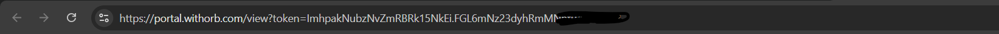
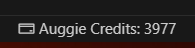

# Auggie Credits

Track your Auggie credits in real-time directly in your VS Code status bar.

## Features

- **Real-time Credit Tracking** - Automatically updates every 45 seconds
- **Silent Background Updates** - No disruptive loading indicators
- **Clean Status Bar Integration** - Displays credits with clear iconography
- **Simple Setup** - One-time configuration with your portal link
- **Secure Token Handling** - Uses official ORB API endpoints

## Setup Guide

### Step 1: Access Your Augment Account
1. Navigate to [Augment Code Account](https://app.augmentcode.com/account/subscription)
2. Log in to your account

### Step 2: View Your Usage
1. On the subscription page, click the **"View Usage"** button

### Step 3: Copy Your Portal Link
1. After clicking "View Usage", copy the **entire URL** from your browser's address bar
2. This URL contains your unique token and looks like: `https://portal.withorb.com/view?token=...`

### Step 4: Configure the Extension
1. In VS Code, look at the **bottom-right status bar**
2. Click on the **"Auggie Credits"** item

3. When prompted, paste the URL you copied from Step 3
4. Press Enter to save

### Step 5: Verify Setup
Your credits will now appear in the status bar as: `Auggie Credits: 4009`
- Updates automatically every 45 seconds
- Hover over the status bar item to see the last update time

## Usage

The extension displays your credit balance in the VS Code status bar with different states:

- **Active**: `Auggie Credits: 4009` - Shows current credit balance
- **Error**: `Auggie Credits: Error` - Indicates connection or authentication issues
- **Setup Required**: `Auggie Credits: Click to set link` - Prompts for initial configuration

## Commands

| Command | Description |
|---------|-------------|
| `Set Auggie Portal Link` | Configure your ORB portal link for credit tracking |

Access commands via Command Palette (`Ctrl+Shift+P` / `Cmd+Shift+P`)

## Configuration

No additional configuration required. The extension automatically:
- Extracts authentication tokens from your portal link
- Connects to ORB API endpoints securely
- Updates credit balance every 45 seconds
- Persists settings across VS Code sessions

## Requirements

- VS Code 1.74.0 or higher
- Active Augment Code subscription
- Internet connection

## Troubleshooting

### "No customer ID found" Error
- **Solution**: Ensure you copied the complete URL from the usage page
- **Check**: URL should contain `portal.withorb.com` and `token=`

### "Failed to fetch credits" Error
- **Solution**: Verify your internet connection and that the portal link is still valid
- **Check**: Try refreshing the usage page and copying the URL again

### Extension Not Showing
- **Solution**: Restart VS Code after installation
- **Check**: Verify the extension is installed and enabled in Extensions view

### Updating Your Portal Link
If you need to change your portal link:
1. Open Command Palette (`Ctrl+Shift+P` / `Cmd+Shift+P`)
2. Type: "Set Auggie Portal Link"
3. Paste your new portal URL

