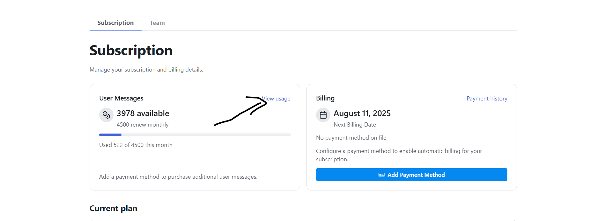
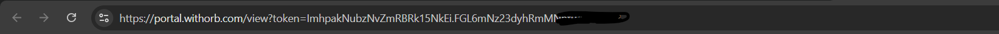
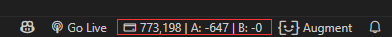

# 🚀 Auggie Credits Setup Guide

> **Complete step-by-step guide to set up your Auggie Credits tracker in VS Code**

## 📋 Prerequisites

- VS Code installed
- Augment Code account with active subscription
- The Auggie Credits extension installed

## 🎯 Step-by-Step Setup

### Step 1: Access Your Augment Account
1. Navigate to **[Augment Code Account](https://app.augmentcode.com/account/subscription)**
2. Log in to your account

### Step 2: View Your Usage
1. On the subscription page, click **"View Usage"** button

### Step 3: Get Your Portal Link
1. After clicking "View Usage", you'll be redirected to a new page
2. **Copy the entire URL** from your browser's address bar

*This URL contains your unique token and is what the extension needs to track your credits*

### Step 4: Open Auggie Credits Extension
1. In VS Code, look at the **bottom-right status bar**
2. Click on the **Auggie Credits** item

### Step 5: Configure Your Portal Link
1. A dialog will appear asking for your portal link
2. **Paste the URL** you copied from Step 3
3. Click **OK** or press **Enter**

### Step 6: Enjoy Real-Time Credit Tracking! 🎉
- Your credits will now appear in the status bar: `$(credit-card) Auggie Credits: 4009`
- Updates automatically every 45 seconds
- Hover over the status bar item to see last update time

## 🔧 Troubleshooting

### ❌ "No customer ID found"
- **Solution**: Make sure you copied the complete URL from the usage page
- **Check**: URL should contain `portal.withorb.com` and `token=`

### ❌ "Failed to fetch credits"
- **Solution**: Verify your internet connection
- **Check**: Make sure the portal link is still valid (not expired)

### ❌ Extension not showing
- **Solution**: Restart VS Code
- **Check**: Extension is installed and enabled

## 🎨 What You'll See

| Status | Display |
|--------|---------|
| **Working** | `$(credit-card) Auggie Credits: 4009` |
| **Setup Needed** | `$(question) Auggie Credits: Click to set link` |
| **Error** | `$(error) Auggie Credits: Error` |

## 🔄 Updating Your Link

If you need to change your portal link:
1. Open Command Palette (`Ctrl+Shift+P`)
2. Type: **"Set Auggie Portal Link"**
3. Paste your new portal URL

## 💡 Pro Tips

- **Bookmark** your usage page for easy access
- **Pin** the Auggie Credits status bar item for visibility
- **Check** your credits before starting big coding sessions
- **Monitor** usage patterns to optimize your workflow

## 🤖 How It Works

1. **Token Extraction** - Gets your unique token from the portal URL
2. **Customer API** - Calls ORB API to get your customer info
3. **Credit Fetching** - Retrieves your current credit balance
4. **Real-Time Updates** - Refreshes every 45 seconds silently

## 🎯 Next Steps

- ⭐ **Star** the [GitHub repository](https://github.com/svsairevanth12/augment-credits)
- 🐛 **Report issues** if you encounter any problems
- 💡 **Suggest features** for future updates
- 📢 **Share** with your team members

---

**Made with 💜 for the Augment community**

*Track your credits like a king! 🤖👑*
